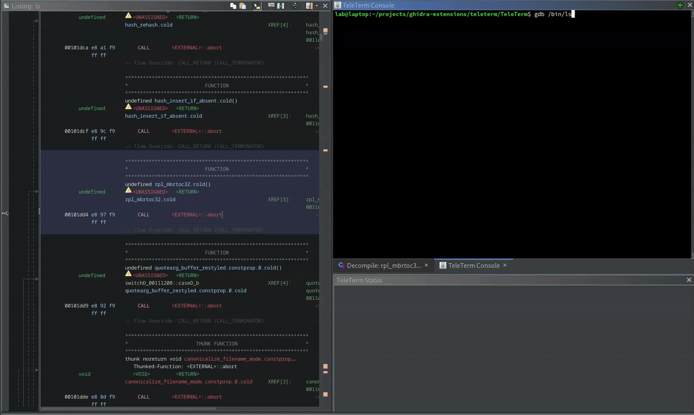

<p align="center">
  
  <br/>
</p>

<p align="center">
    <h2>TeleTerm - A Better Integrated Terminal for Ghidra</h2>
</p>

**TeleTerm** is a dynamic analysis extension for ghidra that *isn't a debugger*. It was originally designed as a decoupled debugger integration, so that you can use GDB or QEMU right next to the code browser, and navigate using it. 

<p align="center">
  
  <br/>
</p>


TeleTerm embeds a full-featured terminal into the Ghidra UI, and supports moving the ghidra code browser based on addresses copied from output in the terminal, and pasting addresses from the code browser, enabling use of any dynamic analysis tool that works in a terminal. 

**It supports scripting workflows with PyGhidra**, so you can add new terminal drop down menus, parse input from the terminal and interact with the ghidra system directly from python, without having to interact with Java or recompile. It supports windows and older versions of ghidra, too!

This extension is very new and in active development. Accepting bug reports and feature requests!

---

## ✨ Features

- 🖥️ Embedded terminal using [JediTerm](https://github.com/JetBrains/jediterm)
- 📋 Address Selection and clipboard integration, supporting go-to selected address, automatic address calculation
- 📜 Python-accessible interface (`TeleTermPythonInterface`) for scripting and automation
- 🧩 Extendable UI with plugin-defined actions and submenus
- 🪄 Optional multiple panes (e.g., status, output console)
- 🧠 Built-in parsing helpers for GDB-like numeric values

## 📦 Building

```sh
./fetch-deps.sh
gradle buildExtension -PGHIDRA_INSTALL_DIR=<your ghidra install>
```

## ⌨️ Python Scripting

You can interact with the terminal and plugin environment using `TeleTermPythonInterface`.

```python
from teleterm.api import TeleTermPythonInterface as TTI

def do_text_menu(input):
    selectionAddr = parseGdbInt(panel.getSelectionText())
    logln("Changed base of .text to " + panel.getSelectionText())
    return True

addAction("python!", do_text_menu) # defines a new menu action, with do_text_menu as callback when clicked
```

---

## 🧑‍💻 Usage

After installing the plugin:

1. Launch Ghidra and load your project.
2. Open the terminal via **Window → TeleTerm**.
3. Use the terminal interactively or control it programmatically via scripting.

---

